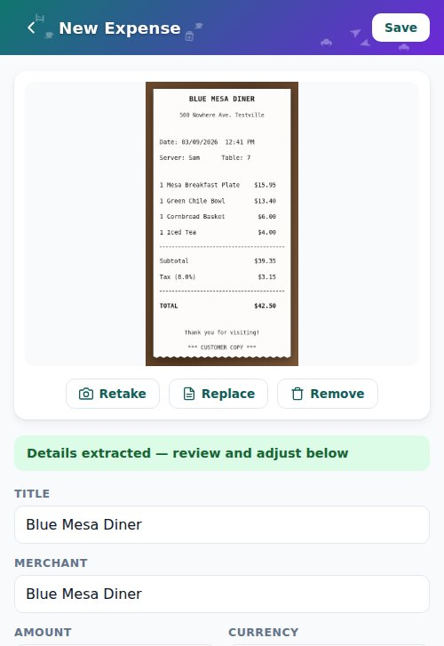
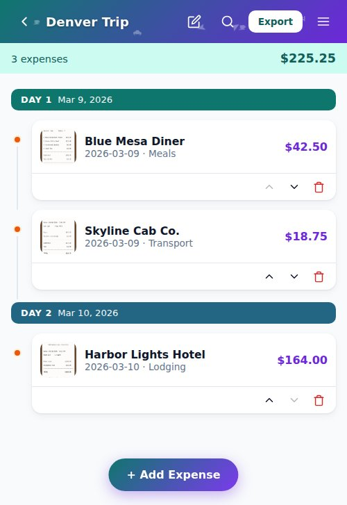
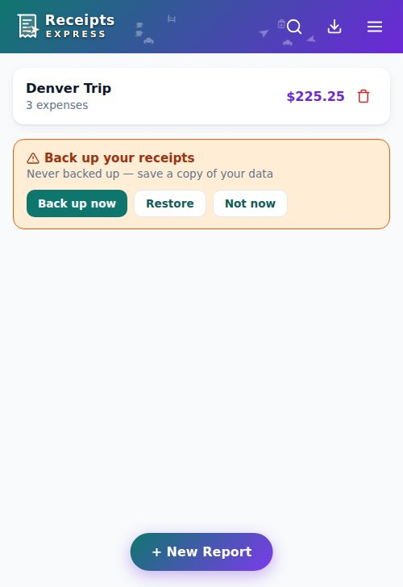

# Receipts Express Pilot Presentation

This markdown file represents the content of the interactive slide deck designed for co-workers who want to participate in the departmental pilot of **Receipts Express**. 

Independent personal project — no affiliation with, endorsement from, or approval by FedEx or any employer.

> **Status: PROPOSAL.** This deck accompanies a proposed departmental pilot. It
> is not an approved, endorsed, or production system for any organization, and
> it is pending whatever governance review process your organization requires
> before adopting a new tool. Nothing here should be read as FedEx approval,
> endorsement, or affiliation — Receipts Express is an independent personal
> project (see the README's
> [Disclaimer & Data Guidance](../README.md#disclaimer--data-guidance)
> section, and [PILOT.md](./PILOT.md) for the proposal itself).

> [!TIP]
> You can also view the interactive, fully animated version of this slide deck directly in your browser by opening [docs/pilot-deck.html](./pilot-deck.html).

---

## Slide 1: Cover

### Receipts Express
**Standardized Receipt-to-PDF Capture**

* **Progressive Web App (Offline-First)**: Runs locally on your device. The app itself is cached when you install it; the OCR and PDF engines are fetched from the app's own origin the first time you use them, and are cached from then on.
* **Private by Design**: No servers, no accounts, zero data sharing.

---

## Slide 2: The Core Challenge

### The Challenge with Expense Capture
*Why traditional reporting causes friction and security risks*

#### 1. The Manual Burden
* Receipts accumulate loose in email inboxes, pockets, or camera rolls during business travel.
* Reconstructing dates, merchants, and totals weeks later leads to errors and delayed filing.
* No quick way to export polished compilations for downstream travel systems.

#### 2. The Privacy Trap
* Free scanner apps commonly bundle third-party analytics or ad-tracking SDKs — an app's privacy label is usually the only evidence a user ever sees of it.
* Sensitive financial data (merchant locations, items purchased, card fractions) can end up uploaded to cloud systems nobody in the organization has vetted.
* Lack of structural boundaries leaves personal and corporate data vulnerable to exfiltration.

---

## Slide 3: The Solution

### Enter Receipts Express
*A fast, private utility running entirely on your device*

#### Key Pilot Features:
* **On-Device OCR**: [Tesseract.js](https://tesseract.projectnaptha.com/) scans receipts and extracts fields locally. No external APIs, no cloud processing.
    > **What is OCR?** OCR (Optical Character Recognition) is the automated technology that reads the text inside receipt images (merchant names, dates, and amounts) and converts it into editable digital text. Running it fully on-device via WebAssembly means no images or transcripts are ever sent over the network to external systems.
* **Photo or PDF Capture**: Receipts can be added as a camera photo or an uploaded PDF (single- or multi-page, e.g. an emailed invoice). PDFs are rasterized on-device via a self-hosted PDF.js, then flow through the same on-device OCR, storage, and export path as a photographed receipt.
* **Reports Manager**: Create, name, and drag-and-drop receipts to reorder. Group expenses easily by business trip.
* **On-Device Storage**: Data stays in your browser's storage sandbox ([IndexedDB](https://developer.mozilla.org/en-US/docs/Web/API/IndexedDB_API)), which keeps it separate from other websites and other apps. Zero servers are involved. The app does not separately encrypt what it stores — what protects it is your device: your screen lock, your account password, and your device's disk encryption. Anyone with your unlocked device and browser profile can open the app and read what is in it, so use it only on a device you control.
* **Local PDF Export**: Generates a comprehensive trip summary followed by full-page receipt images.

---

## Slide 4: Governance & AI-Efficiency

### Governance & Guidelines
*Where this pilot's governance format comes from, and what it does not imply*

Receipts Express's pilot governance structure is formatted after the **AI Pilot Program Template** published in the public GitHub repository [arigatoexpress/AI-Efficiency](https://github.com/arigatoexpress/AI-Efficiency).

* **Inspiration Source**: [arigatoexpress/AI-Efficiency](https://github.com/arigatoexpress/AI-Efficiency). We credit their checklist for establishing the risk-review format we apply to this pilot proposal.
* **Why this matters**: Working through a standardized governance checklist before proposing a tool is what surfaces the privacy, legal, and risk questions early, while they are still cheap to answer. The answers below are the author's own self-assessment; no organization has reviewed or accepted them.

#### Governance Checklist Snapshot:
| Field | Value / Response |
| --- | --- |
| **Data Classification** | Confidential (Receipts contain real personal/financial data) |
| **AI Engine Location** | On-Device Only (Self-hosted Tesseract.js OCR + PDF.js rasterization, both WASM) |
| **Data Egress Control** | Content-Security-Policy with `connect-src 'self'`, delivered in a `<meta>` tag — see the note below for what that does and does not cover |
| **Human-in-the-Loop** | Active (User must verify and edit OCR drafts before saving) |
| **Tool approval status** | Not yet reviewed by any organization's governance process — [PILOT.md](./PILOT.md) is the proposal to start that review |

> **How Governance Applies to this Pilot:**
> * **Data Classification**: Receipts contain names, merchant locations, purchase itemizations, and partial card numbers. That is Confidential employee financial data, and it falls under whatever privacy requirements your organization applies at that classification. Receipts Express keeps all of it local, inside your browser profile's sandboxed storage. Whether that is sufficient for your organization is your organization's reviewer's call, not this deck's.
> * **AI Engine Location**: Organizations commonly restrict transmitting private data to unapproved cloud AI endpoints. Receipts Express avoids the question by self-hosting the Tesseract.js OCR engine, and self-hosting PDF.js for PDF-receipt rasterization the same way. All text recognition and PDF processing runs on your device inside your browser sandbox, and nothing is sent to an external service. The engine files themselves are not part of the install-time precache: they are downloaded from the app's own origin the first time you scan a receipt or open a PDF, then cached for reuse.
> * **Data Egress Control**: The deployed app carries a Content-Security-Policy that restricts fetch, XMLHttpRequest, WebSocket, EventSource and beacon requests to the app's own origin, and blocks form submissions to other origins. It is delivered in a `<meta>` tag, because GitHub Pages cannot send custom response headers, so it does not govern top-level navigation — a compromised dependency could still navigate the page elsewhere. It is a strong control, not an absolute one.
> * **Human-in-the-Loop**: OCR can misread numbers or dates. The engine only populates editable draft inputs; nothing is stored until you accept it. The user is the responsible human owner who must review and manually verify all dates and amounts before exporting the PDF. The app makes no claim that an exported PDF satisfies any employer's reimbursement policy or any tax authority's substantiation requirements — that responsibility stays with the user.

---

## Slide 5: PWA Installation Guide

### Install on Your Device
*Install as a Progressive Web App (PWA) in seconds*

Installing the web app as a PWA **improves the odds** that the browser grants durable storage. The app asks for it on every launch, and browsers are more willing to grant it to an installed app than to an ordinary tab. It is not a guarantee: the browser answers that request however it likes, `false` is a common answer, and the app treats a refusal as the normal case rather than an error. Install it, and keep backing up regardless.

#### iOS (Safari)
1. Open the app link in Safari.
2. Tap the **Share** button (box with up-arrow) in the browser toolbar.
3. Scroll down and select **Add to Home Screen** (plus icon).

#### Android (Chrome)
1. Open the app link in Chrome.
2. Tap the **Menu** icon `⠇` (three vertical dots).
3. Select **Install app** (download icon).

#### Desktop (Chrome / Edge / Safari)
1. Open the app link in Chrome or Edge.
2. Click the **Install icon** inside the right side of the address bar.
3. Alternatively, select **Install Receipts Express** from the browser's settings menu.

---

## Slide 6: Backup Architecture & Risks

### Backup Architecture & Risks
*Understanding browser storage lifecycle and durability*

#### Storage Eviction Risk
Since all receipts and images are stored locally in the browser database (IndexedDB) with no cloud backup, they are subject to **data loss** if:
* The device runs critically low on disk space.
* The user manually clears browser cache, cookies, and website data.
* The OS automatically purges browser caches to free up system space.
* On iPhone and iPad, Safari clears a site's data after about a week without a visit, unless the browser has granted the app durable storage. Installing the app to the Home Screen makes that grant likelier but does not assure it.

#### In-App Backup Dashboard
Receipts Express includes local backup controls to bundle all database records & base64 images into a single `.json` file:
* **The Stale Warning**: The app displays a warning card on the home screen if data goes unbacked-up for more than **7 days**.
* **One-Click Export**: Click **Back up now** to package the database and trigger the browser download/native share sheet.

---

## Slide 7: Backup Recommendations

### Backup Recommendations
*Best practices for pilot participants to safeguard data*

Nothing can make browser storage permanent, so the way to avoid losing receipt data while piloting the web application is to keep a copy outside it. Participants should follow these backup guidelines:

1. **Save JSON Backups — Local First, Then Cloud**: When clicking "Back up now", the app generates a single `.json` file containing all data. **Easiest:** save it straight to your device's local storage (Downloads or Files app) first — no login, no upload wait. **Then**, for redundancy, copy that same file into whatever storage your organization approves for data at this classification, under an `Expenses-Backup` folder. The backup file carries the receipt images and all extracted text in the clear, so it is as sensitive as the receipts themselves.
2. **Backup Frequency Rule**: Always export a fresh backup after scanning new receipts on a trip. Do not ignore the in-app "Backup stale" warning. Treat Receipts Express as a **capture utility, not a long-term archive**. Export the final expense report PDF promptly.
3. **Cross-Device Restore**: If you upgrade your phone or switch browsers, export a backup JSON from your old device and click **Restore** on the new device to bring your reports, receipts, and images across. Restore is not a merge: records already on the device that share an ID with a record in the backup are overwritten by the backup's version, and the app asks you to confirm before it writes. Restoring an older backup on top of newer edits replaces those edits, so restore onto the device that has less recent data, not more.

---

## Slide 8: Pilot Next Steps & Safety Guidelines

### Pilot Next Steps
*How to get started and contribute safely*

#### Start with Receipts You Are Free to Use:
Try the app on synthetic receipts you make up, or on your own personal ones. Scan a handful, edit them, export a PDF, back up and restore, and satisfy yourself that the app behaves. Do not put an employer's receipts into it unless that organization has reviewed the tool and approved it for data of this kind.

#### Safe Real-Trip Demo Guidelines:
* [ ] **Use the Live HTTPS Link**: Run the app via the production URL: [https://jwtc2000.github.io/Receipts-Express/](https://jwtc2000.github.io/Receipts-Express/) (also linked at the top of the repository). The deployed app carries a Content-Security-Policy that restricts fetch, XMLHttpRequest, WebSocket, EventSource and beacon requests to the app's own origin, and blocks form submissions to other origins. It is delivered in a `<meta>` tag, because GitHub Pages cannot send custom response headers, so it does not govern top-level navigation — a compromised dependency could still navigate the page elsewhere. It is a strong control, not an absolute one.
* [ ] **What is "Dev Mode"?**: Regular pilot participants will not be using dev mode. "Dev mode" refers only to developers running raw source code on their personal laptops (using `npm run dev`), where the Content-Security-Policy is not injected at all, because Vite's hot-reload serves styles inline in a way the policy would block. The policy described above applies to the deployed site, which is what participants use.
* [ ] **Export, Then Clear**: Scan receipts as they happen, export the complete PDF/CSV on the final day of travel, file it wherever your organization requires, and then clear the data from the PWA.
    > **How to clear it:** Open the Menu on the home screen and tap the trash icon on the report to delete it (and all its receipt images) — you'll be asked to confirm. To wipe everything in one step instead, use your browser's site settings → "Clear site data" for this origin.
    > **Why:** once a report is exported and safely backed up, there's no reason for employer receipt images or OCR'd text to keep sitting on your device. Deleting it shortens the window during which that data could be exposed if the device is lost, shared, or compromised.
* [ ] **Minimize Storage Duration**: Keep receipts in the app only as long as you are still working on the report. Whatever filing schedule your organization sets, the shorter the data sits in the local browser database (IndexedDB), the smaller the exposure.
* [ ] **Daily Backups — Local First, Then Cloud**: Export a JSON backup daily during travel. Easiest option: save it straight to your device's local storage (Downloads or Files app) — no login, no upload wait. Then, for redundancy, copy that same file the same day into whatever storage your organization approves for data at this classification.
* [ ] **Verify and Report**: Cross-check OCR data values against the physical receipts and log formatting suggestions.

---

*Introduction to Receipts Express | Github: [Jwtc2000](https://github.com/Jwtc2000) | [Report a bug](https://github.com/Jwtc2000/Receipts-Express/issues) | Inspired by [AI-Efficiency](https://github.com/arigatoexpress/AI-Efficiency)*
